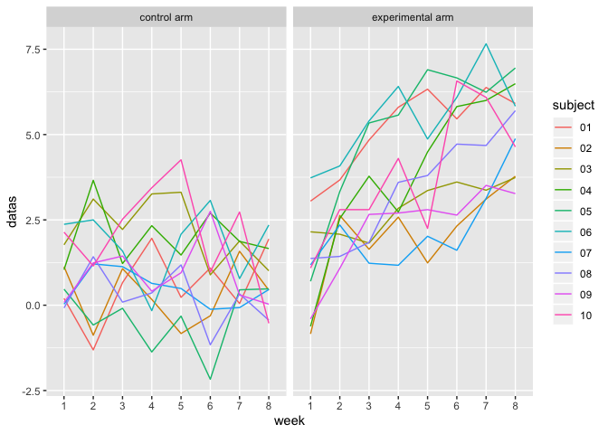
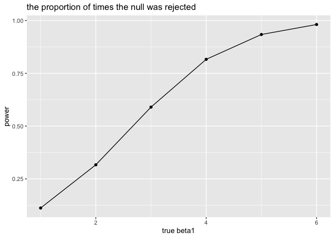
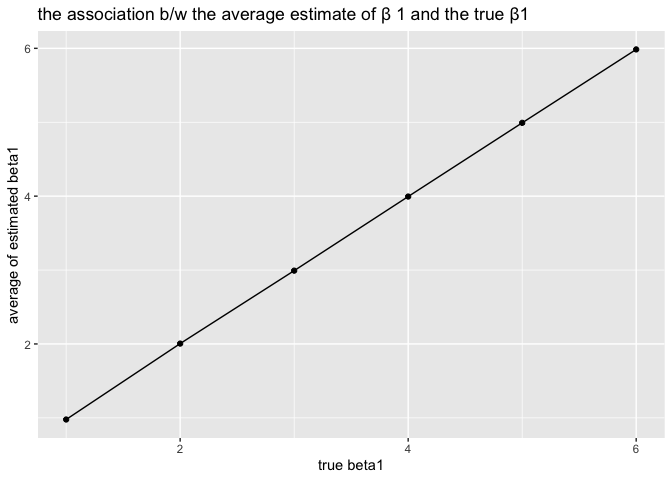
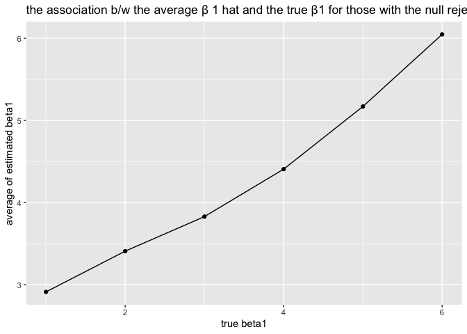

p8105\_hw5\_jl5549
================

``` r
set.seed(10)

iris_with_missing = iris %>% 
  map_df(~replace(.x, sample(1:150, 20), NA)) %>%
  mutate(Species = as.character(Species))
iris_with_missing
```

    ## # A tibble: 150 x 5
    ##    Sepal.Length Sepal.Width Petal.Length Petal.Width Species
    ##           <dbl>       <dbl>        <dbl>       <dbl> <chr>  
    ##  1          5.1         3.5          1.4         0.2 setosa 
    ##  2          4.9         3            1.4         0.2 setosa 
    ##  3          4.7         3.2          1.3         0.2 setosa 
    ##  4          4.6         3.1          1.5        NA   setosa 
    ##  5          5           3.6          1.4         0.2 setosa 
    ##  6          5.4         3.9          1.7         0.4 setosa 
    ##  7         NA           3.4          1.4         0.3 setosa 
    ##  8          5           3.4          1.5         0.2 setosa 
    ##  9          4.4         2.9          1.4         0.2 setosa 
    ## 10          4.9         3.1         NA           0.1 setosa 
    ## # … with 140 more rows

``` r
fill_missing = function(col) {
  if(is.numeric(col)) {
    col = replace_na(col, mean(col, na.rm = T))
    }
   else if(is.character(col)) {
    col = replace_na(col, 'virginica')
    }
  col
}
iris_without_missing = map(iris_with_missing, fill_missing) %>% 
  bind_rows()
head(iris_without_missing)
```

    ## # A tibble: 6 x 5
    ##   Sepal.Length Sepal.Width Petal.Length Petal.Width Species
    ##          <dbl>       <dbl>        <dbl>       <dbl> <chr>  
    ## 1          5.1         3.5          1.4        0.2  setosa 
    ## 2          4.9         3            1.4        0.2  setosa 
    ## 3          4.7         3.2          1.3        0.2  setosa 
    ## 4          4.6         3.1          1.5        1.19 setosa 
    ## 5          5           3.6          1.4        0.2  setosa 
    ## 6          5.4         3.9          1.7        0.4  setosa

Problem 2

``` r
path = list.files('./data')
mydata=cbind(path)
mydata = as.tibble(mydata)
```

    ## Warning: `as.tibble()` is deprecated, use `as_tibble()` (but mind the new semantics).
    ## This warning is displayed once per session.

``` r
mydata = mydata %>% 
  mutate( names = path,
          paths = str_c('./data/', path)
          ) %>% 
  select(-path) %>% 
  pivot_wider(
             names_from = names,
             values_from = paths)
name = colnames(mydata)
```

``` r
data = map_df(.x = mydata, ~read_csv(file = .x)) %>% 
  mutate(names = name) %>% 
  select(names, everything()) %>% 
  separate(names, into= c('group','subject'), sep = '_') %>% 
  #separate(subject, into= c('subjects','trash'), sep = 2) %>%  
 # select(-trash) %>% 
  pivot_longer(week_1:week_8,
               values_to = 'datas',
               names_to = 'week',
               names_prefix = 'week_') %>% 
  mutate(group = recode(group, 'con' = 'control arm',
                        'exp' = 'experimental arm'),
         subject = str_replace(subject, '.csv', '')) %>% 
  as.tibble()
```

    ## Parsed with column specification:
    ## cols(
    ##   week_1 = col_double(),
    ##   week_2 = col_double(),
    ##   week_3 = col_double(),
    ##   week_4 = col_double(),
    ##   week_5 = col_double(),
    ##   week_6 = col_double(),
    ##   week_7 = col_double(),
    ##   week_8 = col_double()
    ## )
    ## Parsed with column specification:
    ## cols(
    ##   week_1 = col_double(),
    ##   week_2 = col_double(),
    ##   week_3 = col_double(),
    ##   week_4 = col_double(),
    ##   week_5 = col_double(),
    ##   week_6 = col_double(),
    ##   week_7 = col_double(),
    ##   week_8 = col_double()
    ## )
    ## Parsed with column specification:
    ## cols(
    ##   week_1 = col_double(),
    ##   week_2 = col_double(),
    ##   week_3 = col_double(),
    ##   week_4 = col_double(),
    ##   week_5 = col_double(),
    ##   week_6 = col_double(),
    ##   week_7 = col_double(),
    ##   week_8 = col_double()
    ## )
    ## Parsed with column specification:
    ## cols(
    ##   week_1 = col_double(),
    ##   week_2 = col_double(),
    ##   week_3 = col_double(),
    ##   week_4 = col_double(),
    ##   week_5 = col_double(),
    ##   week_6 = col_double(),
    ##   week_7 = col_double(),
    ##   week_8 = col_double()
    ## )
    ## Parsed with column specification:
    ## cols(
    ##   week_1 = col_double(),
    ##   week_2 = col_double(),
    ##   week_3 = col_double(),
    ##   week_4 = col_double(),
    ##   week_5 = col_double(),
    ##   week_6 = col_double(),
    ##   week_7 = col_double(),
    ##   week_8 = col_double()
    ## )
    ## Parsed with column specification:
    ## cols(
    ##   week_1 = col_double(),
    ##   week_2 = col_double(),
    ##   week_3 = col_double(),
    ##   week_4 = col_double(),
    ##   week_5 = col_double(),
    ##   week_6 = col_double(),
    ##   week_7 = col_double(),
    ##   week_8 = col_double()
    ## )
    ## Parsed with column specification:
    ## cols(
    ##   week_1 = col_double(),
    ##   week_2 = col_double(),
    ##   week_3 = col_double(),
    ##   week_4 = col_double(),
    ##   week_5 = col_double(),
    ##   week_6 = col_double(),
    ##   week_7 = col_double(),
    ##   week_8 = col_double()
    ## )
    ## Parsed with column specification:
    ## cols(
    ##   week_1 = col_double(),
    ##   week_2 = col_double(),
    ##   week_3 = col_double(),
    ##   week_4 = col_double(),
    ##   week_5 = col_double(),
    ##   week_6 = col_double(),
    ##   week_7 = col_double(),
    ##   week_8 = col_double()
    ## )
    ## Parsed with column specification:
    ## cols(
    ##   week_1 = col_double(),
    ##   week_2 = col_double(),
    ##   week_3 = col_double(),
    ##   week_4 = col_double(),
    ##   week_5 = col_double(),
    ##   week_6 = col_double(),
    ##   week_7 = col_double(),
    ##   week_8 = col_double()
    ## )
    ## Parsed with column specification:
    ## cols(
    ##   week_1 = col_double(),
    ##   week_2 = col_double(),
    ##   week_3 = col_double(),
    ##   week_4 = col_double(),
    ##   week_5 = col_double(),
    ##   week_6 = col_double(),
    ##   week_7 = col_double(),
    ##   week_8 = col_double()
    ## )
    ## Parsed with column specification:
    ## cols(
    ##   week_1 = col_double(),
    ##   week_2 = col_double(),
    ##   week_3 = col_double(),
    ##   week_4 = col_double(),
    ##   week_5 = col_double(),
    ##   week_6 = col_double(),
    ##   week_7 = col_double(),
    ##   week_8 = col_double()
    ## )
    ## Parsed with column specification:
    ## cols(
    ##   week_1 = col_double(),
    ##   week_2 = col_double(),
    ##   week_3 = col_double(),
    ##   week_4 = col_double(),
    ##   week_5 = col_double(),
    ##   week_6 = col_double(),
    ##   week_7 = col_double(),
    ##   week_8 = col_double()
    ## )
    ## Parsed with column specification:
    ## cols(
    ##   week_1 = col_double(),
    ##   week_2 = col_double(),
    ##   week_3 = col_double(),
    ##   week_4 = col_double(),
    ##   week_5 = col_double(),
    ##   week_6 = col_double(),
    ##   week_7 = col_double(),
    ##   week_8 = col_double()
    ## )
    ## Parsed with column specification:
    ## cols(
    ##   week_1 = col_double(),
    ##   week_2 = col_double(),
    ##   week_3 = col_double(),
    ##   week_4 = col_double(),
    ##   week_5 = col_double(),
    ##   week_6 = col_double(),
    ##   week_7 = col_double(),
    ##   week_8 = col_double()
    ## )
    ## Parsed with column specification:
    ## cols(
    ##   week_1 = col_double(),
    ##   week_2 = col_double(),
    ##   week_3 = col_double(),
    ##   week_4 = col_double(),
    ##   week_5 = col_double(),
    ##   week_6 = col_double(),
    ##   week_7 = col_double(),
    ##   week_8 = col_double()
    ## )
    ## Parsed with column specification:
    ## cols(
    ##   week_1 = col_double(),
    ##   week_2 = col_double(),
    ##   week_3 = col_double(),
    ##   week_4 = col_double(),
    ##   week_5 = col_double(),
    ##   week_6 = col_double(),
    ##   week_7 = col_double(),
    ##   week_8 = col_double()
    ## )
    ## Parsed with column specification:
    ## cols(
    ##   week_1 = col_double(),
    ##   week_2 = col_double(),
    ##   week_3 = col_double(),
    ##   week_4 = col_double(),
    ##   week_5 = col_double(),
    ##   week_6 = col_double(),
    ##   week_7 = col_double(),
    ##   week_8 = col_double()
    ## )
    ## Parsed with column specification:
    ## cols(
    ##   week_1 = col_double(),
    ##   week_2 = col_double(),
    ##   week_3 = col_double(),
    ##   week_4 = col_double(),
    ##   week_5 = col_double(),
    ##   week_6 = col_double(),
    ##   week_7 = col_double(),
    ##   week_8 = col_double()
    ## )
    ## Parsed with column specification:
    ## cols(
    ##   week_1 = col_double(),
    ##   week_2 = col_double(),
    ##   week_3 = col_double(),
    ##   week_4 = col_double(),
    ##   week_5 = col_double(),
    ##   week_6 = col_double(),
    ##   week_7 = col_double(),
    ##   week_8 = col_double()
    ## )
    ## Parsed with column specification:
    ## cols(
    ##   week_1 = col_double(),
    ##   week_2 = col_double(),
    ##   week_3 = col_double(),
    ##   week_4 = col_double(),
    ##   week_5 = col_double(),
    ##   week_6 = col_double(),
    ##   week_7 = col_double(),
    ##   week_8 = col_double()
    ## )

``` r
head(data)
```

    ## # A tibble: 6 x 4
    ##   group       subject week  datas
    ##   <chr>       <chr>   <chr> <dbl>
    ## 1 control arm 01      1      0.2 
    ## 2 control arm 01      2     -1.31
    ## 3 control arm 01      3      0.66
    ## 4 control arm 01      4      1.96
    ## 5 control arm 01      5      0.23
    ## 6 control arm 01      6      1.09

``` r
data %>% 
  ggplot(aes(x = week, y = datas, color = subject))+
  geom_line(aes(group = subject)) +
  facet_grid(~group)
```

<!-- -->

Datas in the experimental arm group are generally higher than those in
the control arm group.

Problem 3

``` r
#write the simulation function
sim_regression = function(n=30, beta0 =2 ,beta1){
  sim_data =tibble(x = rnorm(n),
                   y = beta0 + beta1*x + rnorm(n, mean = 0, sd = sqrt(50)))
  ls_fit = lm(y~x, data = sim_data) %>% 
    broom::tidy() %>% 
    subset(term == 'x') %>% 
    select(estimate, p.value) 
 # tibble(
  #  bate0_hat = coef(ls_fit)[1],
   # beta1_hat = coef(ls_fit)[2]
  #)
}
#create 10000 datasets from the function
datasets = 
  rerun(10000, sim_regression(30,2,0)) %>% 
  bind_rows() 
head(datasets)
```

    ## # A tibble: 6 x 2
    ##   estimate  p.value
    ##      <dbl>    <dbl>
    ## 1    2.02  0.207   
    ## 2    1.23  0.182   
    ## 3    0.603 0.606   
    ## 4    3.03  0.000149
    ## 5   -1.19  0.471   
    ## 6   -1.49  0.219

``` r
#repeat above for β1={1,2,3,4,5,6}
rep = function(){
datasets2 = vector('list', 6)
for(i in 1:6) {
  datasets2[[i]] = sim_regression(30, 2 , i)
  }  
datasets2 =
  bind_rows(datasets2) %>% 
  mutate(beta1 = c(1:6)) %>% 
  select(beta1, everything())
datasets2
}
datasets3 = rerun(10000, rep()) %>% 
  bind_rows() %>% 
  mutate(results = ifelse(p.value > 0.05, 
                             'fail_to_reject',
                             'reject')) %>% 
  select(beta1, results, everything()) 

datasets4 = 
  datasets3 %>% 
  group_by(results, beta1) %>% 
  count() %>% 
  mutate(prop = n/10000) %>% 
  subset(results == 'reject')
  
head(datasets4)
```

    ## # A tibble: 6 x 4
    ## # Groups:   results, beta1 [6]
    ##   results beta1     n  prop
    ##   <chr>   <int> <int> <dbl>
    ## 1 reject      1  1120 0.112
    ## 2 reject      2  3166 0.317
    ## 3 reject      3  5899 0.590
    ## 4 reject      4  8162 0.816
    ## 5 reject      5  9339 0.934
    ## 6 reject      6  9812 0.981

``` r
#plot showing the proportion of times the null was rejected
datasets4 %>% 
  ggplot(aes(x = beta1, y = prop))+
  geom_point()+
  geom_line()+
  labs(y= 'power',
       x = 'true beta1',
       title = 'the proportion of times the null was rejected')
```

<!-- --> We
can see when effect size (true beta1 - beta0 )increases, the power
increases.

``` r
datasets3
```

    ## # A tibble: 60,000 x 4
    ##    beta1 results        estimate    p.value
    ##    <int> <chr>             <dbl>      <dbl>
    ##  1     1 fail_to_reject   0.0877 0.947     
    ##  2     2 reject           4.11   0.000880  
    ##  3     3 reject           3.81   0.00200   
    ##  4     4 reject           6.03   0.0000401 
    ##  5     5 reject           6.06   0.00000214
    ##  6     6 reject           4.52   0.000369  
    ##  7     1 fail_to_reject   1.67   0.166     
    ##  8     2 fail_to_reject   0.756  0.646     
    ##  9     3 reject           3.22   0.0312    
    ## 10     4 reject           4.22   0.00162   
    ## # … with 59,990 more rows

``` r
#plot showing the average estimate of β 1 and the true β1
datasets3 %>% 
  group_by(beta1) %>% 
  summarize(m = mean(estimate)) %>% 
  ggplot(aes(x = beta1, y = m))+
  geom_point()+
  geom_line()+
  labs(x = 'true beta1',
       y = 'average of estimated beta1',
       title = 'the association b/w the average estimate of β 1 and the true β1')
```

<!-- -->

``` r
#same thing but only for those with the null rejected
datasets3 %>% 
  filter(results == 'reject') %>% 
  group_by(beta1) %>% 
  summarize(m = mean(estimate)) %>% 
  ggplot(aes(x = beta1, y = m))+
  geom_point()+
  geom_line()+
  labs(x = 'true beta1',
       y = 'average of estimated beta1',
       title = 'the association b/w the average β 1 hat and the true β1 for those with the null rejected ')
```

<!-- -->

The sample average of β̂ 1 across tests for which the null is rejected
does not approximately equal to the true value of β1 until β1 gets
higher, because of effective size is getting higher too.
